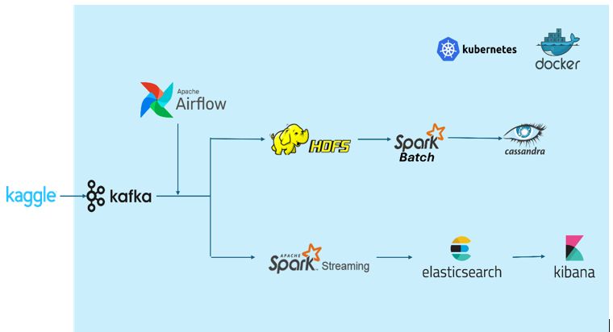
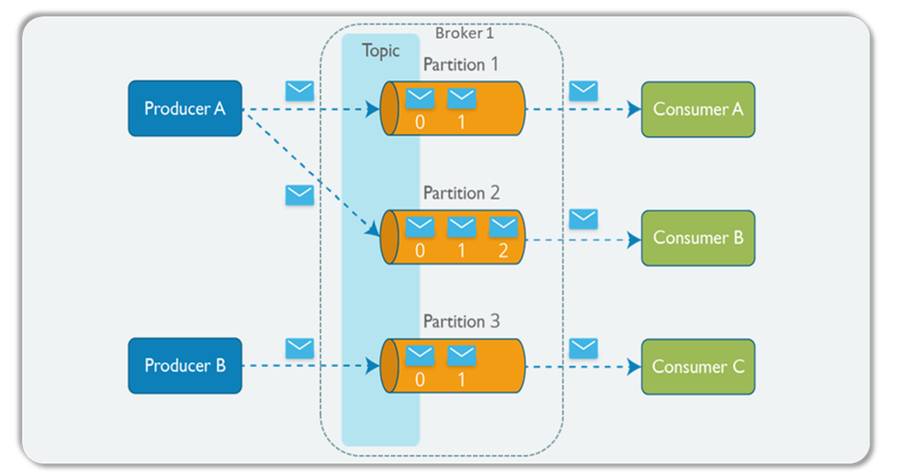
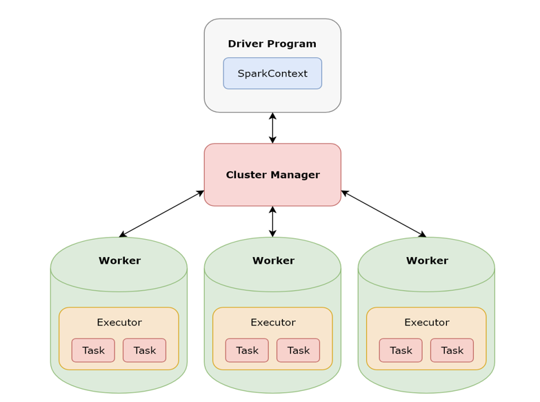
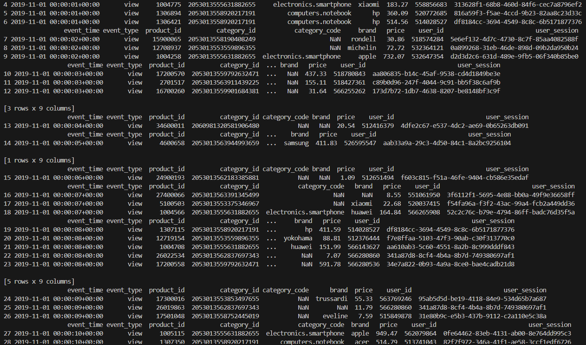
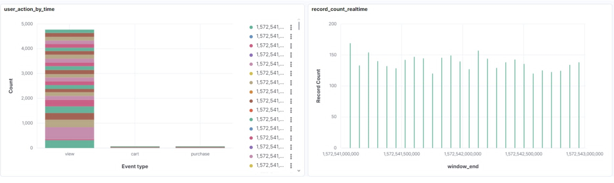
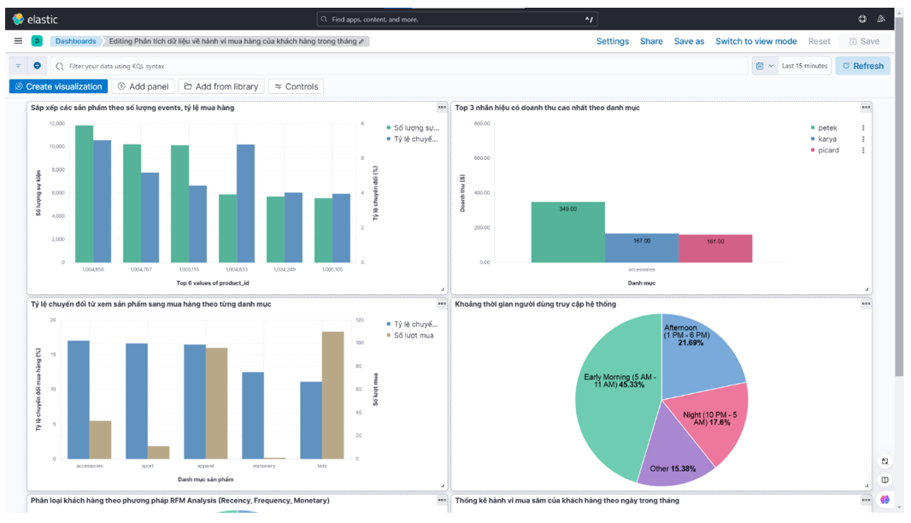
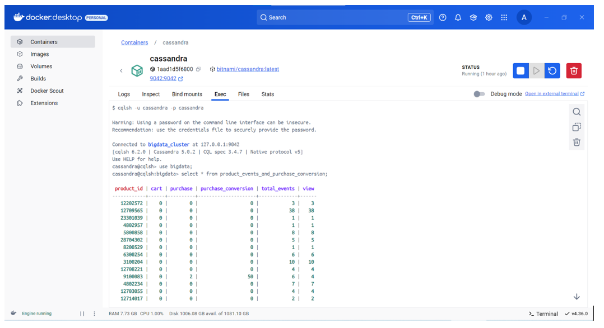
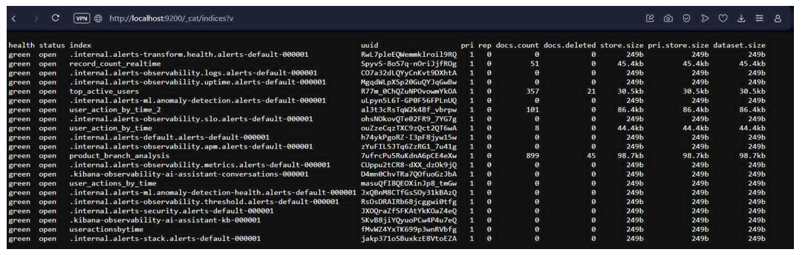
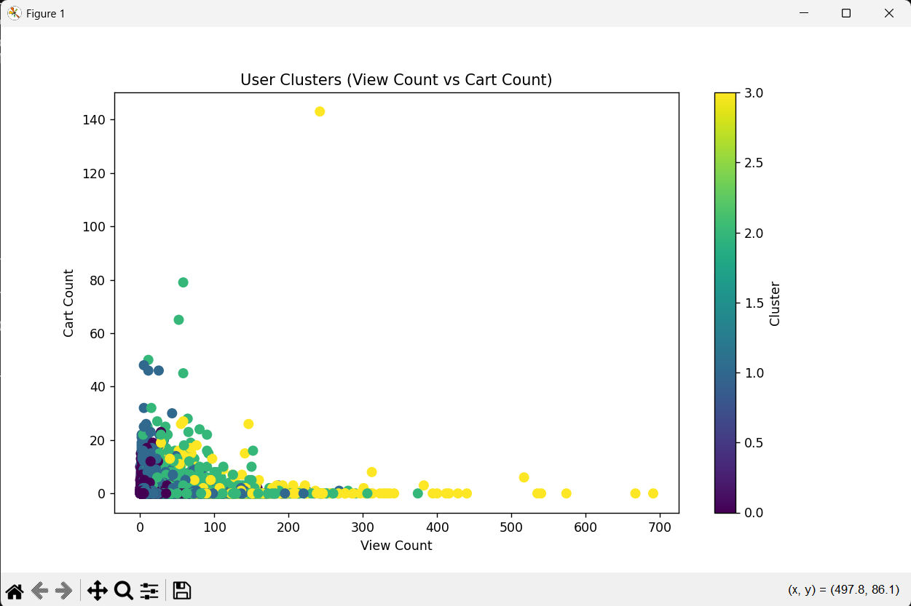
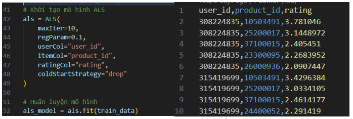

# HUST_IT4931

***Đại học Bách Khoa Hà Nội***

***Môn học: Lưu trữ và xử lý dữ liệu lớn***

***Nhóm: 13***

| STT | Họ và Tên            | Mã Sinh Viên | Email                        |
|-----|----------------------|--------------|-------------------------------|
| 1   | [Nguyễn Đình Tùng](https://www.facebook.com/ahihitungoi)      | 20215663     | tung.nd215663@sis.hust.edu.vn
| 2   | [Nguyễn Đức Duy](https://www.facebook.com/Dxy.1307)        | 20210275     | duy.nd210275@sis.hust.edu.vn
| 3   | [Đào Anh Quân](https://www.facebook.com/profile.php?id=100013755369820)          | 20215631     | quan.da215631@sis.hust.edu.vn
| 4   | [Vũ Thị Thanh Hoa](https://www.facebook.com/profile.php?id=100062067740273)      | 20210356     | hoa.vtt210356@sis.hust.edu.vn
| 5   | [Ngân Văn Thiện](https://www.facebook.com/thien.nganvan.16)        | 20215647     | thien.nv215647@sis.hust.edu.vn

## 1. About dataset

### About
This file contaisn behavior data for 7 months (from October 2019 to April 2020) from a large multi-category online store.

Each row in the file represents an event. All events are related to products and users. Each event is like many-to-many relation between products and users.

### How to read it
There are different types of events. See below.

Semantics (or how to read it):

> User **user_id** during session **user_session** added to shopping cart (property **event_type** is equal **cart**) product **product_id** of brand **brand** of category **category_code** (**category_code**) with price **price** at **event_time**

### File structure

| Property          | Description
|-------------------|----------------------|
| event_time        | Time when event happened at (in UTC).
| event_type        | Only one kind of event: purchase.
| product_id        | ID of a product.
| category_id       | Product's category ID.
| category_code     | Product's category taxonomy (code name) if it was possible to make it. Usually present for meaningful categories and skipped for different kinds of accessories.
| brand             | Downcased string of brand name. Can be missed.
| price             | Float price of a product. Present.
| user_id           | Permanent user ID.
| user_session      | Temporary user's session ID. Same for each user's session. Is changed every time user come back to online store from a long pause.

### Event types

Events can be:
- *view* - a user viewed a product
- *cart* - a user added a product to shopping cart
- *remove_from_cart* - a user removed a product from shopping cart
- *purchase* - a user purchased a product

### Multiple purchases per session

A session can have multiple **purchase** events. It's ok, because it's a single order.

### How to download

You can download this dataset from [Kaggle](https://www.kaggle.com/datasets/mkechinov/ecommerce-behavior-data-from-multi-category-store/data).

### Many thanks

Thanks to [Michael Kechinov](https://www.kaggle.com/datasets/mkechinov/ecommerce-behavior-data-from-multi-category-store/data).

Thanks to [REES46 Marketing Platform](https://rees46.com/) for this dataset.

## 2. Project

### Overview Architecture

This project is built using a distributed architecture that integrates various technologies for efficient data processing, orchestration, storage, and monitoring.



- Docker: Docker is used to containerize the application components, ensuring consistency across different environments (development, staging, production).
- Airflow: Schedules and monitors workflows, such as ETL processes, batch jobs, and data pipeline executions.
- Kafka: Kafka is a distributed streaming platform used for real-time data processing and messaging.
- Spark: Spark is a unified analytics engine for big data processing, providing both batch and stream processing capabilities.
- HDFS: HDFS is used for storing large volumes of data in a distributed manner across a cluster.
- Elasticsearch: Indexes and stores logs and other search-related data, enabling fast and scalable search and analytics operations.
- Kibana: Kibana is a data visualization tool that integrates with Elasticsearch.
- Cassandra: Apache Cassandra is a distributed NoSQL database designed for high availability and scalability.
- Kubernetes: Kubernetes is used for container orchestration and management, ensuring scalability and fault tolerance.

### Architecture Flow

- Data Ingestion: Kafka handles real-time data ingestion from various sources. Data streams are processed and stored in HDFS for batch processing.



- Data Processing: Spark processes large datasets stored in HDFS, performing complex analytics, transformations, and machine learning tasks.



- Data Storage: Processed data is stored in Cassandra for fast, low-latency access and Elasticsearch for search and analytics.
- Orchestration: Airflow manages the execution of workflows, such as data pipelines, and ensures the proper sequence of operations.
- Containerization & Orchestration: Docker containers host each service and component, with Kubernetes managing their deployment and scaling across the infrastructure.
- Monitoring & Visualization: Kibana visualizes the logs and metrics stored in Elasticsearch, providing insights into system performance and potential issues.

### How to Run the Project

1. Run the Project Locally (with Docker Compose)

- Clone the repository:
    ```bash
    git clone https://github.com/Dxy1307/HUST_IT4931.git
    cd HUST_IT4931
    ```

- Build and Start Docker Containers:
    ```bash
    docker-compose up --build
    ```
    This command will build and start the Docker containers for the project components.

    Docker Compose will start all these services and you can check their status with the following command:
    ```bash
    docker-compose ps
    ```

- Access the Services:
    - Kafka: http://localhost:9092

    - Spark: http://localhost:7077

    - Cassandra: http://localhost:9042

    - Elasticsearch: http://localhost:9200

    - Kibana: http://localhost:5601

- Run Airflow DAGs (Data Pipeline Workflows):
    - Airflow is used to manage workflows and DAGs (Directed Acyclic Graphs). Once Airflow is started, you can go to the Airflow interface to check the DAGs and run them.

    - To see the installed DAGs, go to the Airflow interface: http://localhost:8080.

    - Run DAGs to perform tasks such as collecting data from Kafka, processing it with Spark, and storing it to Cassandra.

- Monitor Logs & Metrics:

    - Kibana: Truy cập vào Kibana để theo dõi logs và tạo dashboard để kiểm tra hiệu suất của các dịch vụ.

    - Elasticsearch: Dữ liệu được lưu trữ trong Elasticsearch và có thể được truy vấn hoặc tìm kiếm từ Kibana.

2. Run the Project on a Kubernetes Cluster

### Results

- Data real-time ingestion from Kafka to Spark



- Spark streaming processing



- Spark batch processing



- Data storage in Cassandra



- Data storage in Elasticsearch



- User cluster by BisectingKMeans model



- User recommendation by ALS model



# Dxy